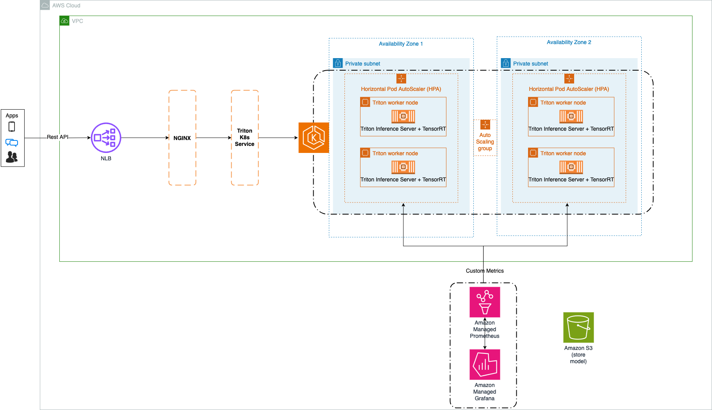

import CollapsibleContent from '../../../../src/components/CollapsibleContent';

:::warning
Deployment of ML models on EKS requires access to GPUs or Neuron instances. If your deployment isn't working, it’s often due to missing access to these resources. Also, some deployment patterns rely on Karpenter autoscaling and static node groups; if nodes aren't initializing, check the logs for Karpenter or Node groups to resolve the issue.
:::

:::caution
The use of [meta-llama/Llama-3.2-1B-Instruct](https://huggingface.co/meta-llama/Llama-3.2-1B-Instruct) model requires access through a Hugging Face account.
:::

# Scaling Inference LLMs with TensorRT-LLM and Triton on EKS
This guide focuses on deploying and scaling large language models (LLMs) using NVIDIA's [TensorRT-LLM](https://github.com/NVIDIA/TensorRT-LLM) backend and the [Triton Inference Server](https://github.com/triton-inference-server/server) on Amazon Elastic Kubernetes Service (EKS). We will demonstrate how to achieve ultra-low latency, specifically targeting a sub-200ms response time for a workload with 500 input tokens and 5 output tokens, using the LLaMA 3.2 1B model on AWS g6e instances powered by the Ada Lovelace GPU architecture. The solution involves leveraging a custom container that is purpose-built specifically for the G6E architecture, optimized for real-time workloads. This guide is ideal for ML engineers and infrastructure practitioners aiming to implement high-performance inference stacks on Kubernetes using NVIDIA’s hardware and Triton’s flexible backend.


# Architecture


## Overview
This architecture enables scalable and low-latency deployment of large language models (LLMs) on Amazon EKS, using NVIDIA’s TensorRT-LLM backend and the Triton Inference Server. It is designed to support a variety of models and latency profiles, with special optimization for ultra-low latency workloads. A custom container—purpose-built for G6E (Ada Lovelace) instances—integrates model-specific tuning, TensorRT-LLM acceleration, and Triton’s flexible multi-backend capabilities to deliver high throughput and minimal response times.

## Key Components
1. At the core of the deployment is the `NVIDIA Triton Inference Server`, a production-ready inference engine designed to serve multiple models efficiently. It supports dynamic batching, concurrent model execution, and multiple backends (e.g., TensorRT, ONNX, PyTorch), making it ideal for complex real-time applications. In this setup, Triton handles all incoming inference requests and routes them to the optimized TensorRT-LLM backend, maximizing hardware utilization and minimizing overhead.
2. The `TensorRT-LLM backend` accelerates LLM inference by converting model weights into highly optimized TensorRT engines, reducing memory footprint and inference latency. It supports multiple precision modes (FP16, INT8) to balance latency and accuracy while reducing memory usage. This backend is key to achieving real-time inference speeds, especially for large models on NVIDIA GPUs.
3. `Amazon EKS` + `Kubernetes`: EKS orchestrates containerized deployment, ensuring pods scale dynamically via the Horizontal Pod Autoscaler (HPA) based on GPU/CPU utilization. The cluster uses NVIDIA GPU-powered instances (e.g., G6E, A10G), ensuring high compute throughput for demanding inference workloads.
4. An `NGINX reverse proxy` coupled with an `AWS Network Load Balancer` distributes incoming HTTP/gRPC requests across Triton pods running in the cluster. This setup ensures even load distribution, high availability, and reduced inference latency across the deployment.
5. Monitoring Stack (`Prometheus` + `Grafana`): Prometheus continuously monitors system health by collecting key metrics such as nv_inference_queue_duration_ms, GPU utilization, and throughput. These metrics are visualized in Grafana dashboards for real-time observability, performance tuning, and alerting.

## Flow
Inference begins when a client sends a request to a public endpoint (HTTP/gRPC) exposed by the Network Load Balancer. The request flows through NGINX, which routes it to one of the Triton Inference Server pods running in the EKS cluster. Triton processes the request—batching it if applicable—and forwards it to the TensorRT-LLM backend, which executes the model using a precompiled TensorRT engine. The result is returned through through the same path, ultimately reaching the client.

During this process, Prometheus collects telemetry data such as inference queue latency and GPU utilization to maintain SLA compliance and provide operational visibility.


# Implementation
<CollapsibleContent header={<h2><span>Prepare your environment</span></h2>}>
Before getting started, ensure your environment is set up with the necessary prerequisites for a smooth deployment experience. You’ll need a machine to drive the deployment and interact with the container running the LLaMA 3 inferencing workload. This can be an [EC2 instance](https://docs.aws.amazon.com/AWSEC2/latest/UserGuide/EC2_GetStarted.html), a Mac, or a Windows machine.

> 💡 **Tip**: Using an EC2 instance simplifies networking and access to other AWS services in your deployment pipeline.

> **Note**: The rest of this guide assumes you're using an EC2 instance.

### Prerequisites:
- Machine Requirements:
    - Docker installed (with at least 100GB of free storage)
    - x86 architecture (for building the container image)

- Clone the`ai-on-eks` github repository and navigate to the appropriate directory:
    ```bash
    git clone https://github.com/awslabs/ai-on-eks.git
    cd ai-on-eks/blueprints/inference/trtllm-nvidia-triton-server-gpu
    ```

- Ensure Access:
    * HuggingFace Model: meta-llama/Llama-3.2-1B-Instruct
    * NGC API Key. Follow instructions [here](https://docs.nvidia.com/ai-enterprise/deployment/spark-rapids-accelerator/latest/appendix-ngc.html)
    * HF Token. Follow instructions [here](https://huggingface.co/docs/hub/en/security-tokens)

- Configure AWS CLI
    ```bash
    aws configure
    ```

- In a hurry? Skip to the Quick Setup section below to install everything with a single script. Otherwise, manually install the following tools on your EC2 instance:
    * Conda
    * Docker
    * [kubectl](https://Kubernetes.io/docs/tasks/tools/)
    * [terraform](https://learn.hashicorp.com/tutorials/terraform/install-cli)
    * [AWS CLI](https://docs.aws.amazon.com/cli/latest/userguide/install-cliv2.html)
    * Git (required only for EC2)
    * [tensorrtllm_backend](https://github.com/triton-inference-server/tensorrtllm_backend) — clone the version aligned with the container's TensorRT-LLM version.
        * For this guide: Triton 25.01 with TensorRT-LLM v0.17.0.
        * Refer to the [support matrix](https://docs.nvidia.com/deeplearning/frameworks/support-matrix/index.html) for version compatibility.
    * Python dependencies
        ```bash
        pip install 'tritonclient[all]' pandas numpy transformers 'huggingface_hub[cli]'
        ```

### Quick Setup
To install all prerequisites in one go, run the provided setup script:
```bash
chmod +x setup-environment.sh
./setup-environment.sh
```
This script takes care of installing everything, including the tensorrtllm_backend.
> Note: Make sure to select the correct branch version of tensorrtllm_backend that matches your container image version.
Open a new terminal, run:
```bash
cd ai-on-eks/blueprints/inference/trtllm-nvidia-triton-server-gpu
conda activate ai-on-eks
```

### EC2 Instance Type Availability
The `g6e` instance family (featuring Ada Lovelace GPUs) is only available in select AWS regions. To verify availability in your preferred region, run the following script (make sure to update the instance_types variable):
```bash
python check-ec2-availability.py
```
This helps ensure that your target region supports the GPU instance types required for this deployment.

### Model Preparation
Once your environment is ready, create a directory to store model weights and download LLaMA 3 model using Hugging Face CLI. Save them to a dedicated folder that will be used for conversion.
```bash
cd llama
huggingface-cli login --token <replace-with-your-hf-token>
huggingface-cli download meta-llama/Llama-3.2-1B-Instruct --local-dir Llama-3.2-1B-Instruct
```

> **Note**: Ensure that your Hugging Face account has access to the meta-llama models and that you are logged in via the CLI before downloading.

</CollapsibleContent>

## Start Triton Inference Server
This section walks you through the steps to:
* Launching the Triton Inference Server inside a Docker container
* Building a TensorRT-optimized LLaMA model
    * Includes checkpoint conversion, engine compilation, and model loading.
    * ⚠️ Important: GPU architecture-specific builds are required (e.g., Hopper vs Ampere)
* Serving the model via Triton
* Running a test inference

### Step 1: Navigate to setup directory
```bash
cd ~/ai-on-eks/blueprints/inference/trtllm-nvidia-triton-server-gpu
```

### Step 2: Run Triton server in Docker
> Note: This step takes ~10 mins to download image and mount the volumes. Will be instant for subsequent runs.
Start the server with required GPU access and mount points:
```bash
docker run --rm -it --net host --shm-size=2g \
    --ulimit memlock=-1 \
    --ulimit stack=67108864 \
    --gpus=1 \
    -v $(pwd)/llama:/llama \
    -v $(pwd)/triton_engines:/engines \
    -v $(pwd)/triton_model_files:/triton_model_files \
    -v $(pwd)/build-and-launch-triton.sh:/tmp/build-and-launch-triton.sh \
    -v /home/ubuntu/tensorrtllm_backend:/tensorrtllm_backend \
    nvcr.io/nvidia/tritonserver:25.01-trtllm-python-py3
```

### Step 3: Build and launch inside Container
Before executing the script, ensure that `HF_LLAMA_MODEL` is correctly set in `build-and-launch-triton.sh` to point to your locally downloaded Hugging Face model (in this case to `/llama/Llama-3.2-1B-Instruct`).
Then run:
```bash
chmod +x /tmp/build-and-launch-triton.sh
sh /tmp/build-and-launch-triton.sh
```

<CollapsibleContent header={<h3><span>Notes on `build-and-launch-triton.sh`</span></h2>}>
Here are a few important aspects to keep in mind while setting up and configuring your deployment:
1. Workflow Overview: The end-to-end process consists of three main stages:
    - **Convert**: Transform model weights from various source frameworks (e.g., Hugging Face, DeepSpeed) into a TensorRT-LLM-compatible checkpoint.
    - **Build**: Use a unified command to compile the checkpoint into highly optimized TensorRT engines.
    - **Load**: Load the generated engines into the TensorRT-LLM model runner and evaluate them using various benchmarking or evaluation tasks.

2. Visual Workflow: The conversion flow can be visualized as:
```text
NeMo -------------
                  |
HuggingFace ------
                  |   convert                             build                    load
Modelopt ---------  ----------> TensorRT-LLM Checkpoint --------> TensorRT Engine ------> TensorRT-LLM ModelRunner
                  |
JAX --------------
                  |
DeepSpeed --------
```

3. Creating a Triton-Compatible Model: To make a model Triton-readable, you must properly set values in the model configuration files. A good reference template for inflight batching can be found in [tensorrtllm_backend/all_models/inflight_batcher_llm](https://github.com/triton-inference-server/tensorrtllm_backend/tree/main/all_models/inflight_batcher_llm).

4. Customizing Configuration Scripts: To tailor your deployment beyond the default minimal configuration, refer to the template script: `FILL_TEMPLATE_SCRIPT`. For optimal performance or customization, consult the official resources:
    - [Triton Model Config Guide](https://docs.nvidia.com/deeplearning/triton-inference-server/user-guide/docs/tensorrtllm_backend/docs/model_config.html)
    - [Performance Best Practices](https://github.com/menloresearch/cortex.tensorrt-llm/blob/48e51b8c2f36cc17b33204d3699c1c6ef9e467d6/docs/source/performance/perf-best-practices.md)

5. Key build Flags for `trtllm-build`:
    * `--multiple_profiles`: Improves throughput by supporting different sequence lengths; outputs may slightly vary, but quality remains intact.
    * `--max_batch_size`: Choose a power of 2 near your expected concurrent request count. For ~80 RPS, 2048 is a good starting point.
    * `--max_num_tokens`: Plan based on expected load. For example, 80 requests × 500 tokens = 40K tokens; a safe ceiling is 65536 (i.e., 1024 × 8 × 4 × 2).
    * `--reduce_fusion`: Recommended for tensor parallelism setups to improve kernel fusion efficiency.

6. Recommended Limits: Avoid setting `max_num_tokens` above 16384 unless required. Exceeding this can lead to TensorRT tensor volume overflows without noticeable performance gains.
</CollapsibleContent>

### Step 4: Run a sample inference
Open a new terminal (keep Triton container running) and test inference with:
```bash
curl -X POST localhost:8000/v2/models/ensemble/generate \
-d '{"text_input": "Explain concisely in simple words, the following concepts: reward modeling, policy distillation, offline RL loops, and when to ditch RL for direct‑pref learning.", "max_tokens": 256, "bad_words": "", "stop_words": ""}' | jq -r '.text_output'
```
> Note: Use `jq` to format and extract the response text for easier readability.

Expected response:
```text
  % Total    % Received % Xferd  Average Speed   Time    Time     Time  Current
                                 Dload  Upload   Total   Spent    Left  Speed
100  1653    0  1418  100   235   1338    221  0:00:01  0:00:01 --:--:--  1560


## Step 1: Define Reward Modeling
Reward modeling is a technique used in reinforcement learning (RL) to create a model that predicts the expected return or reward for a given action in a given state. This model is then used to guide the agent's decision-making process.

## Step 2: Define Policy Distillation
Policy distillation is a technique used in RL to reduce the complexity of a policy (a mapping from states to actions) by learning a simpler policy that captures the essential features of the original policy. This is done by minimizing the difference between the original policy and the distilled policy.

## Step 3: Explain Offline RL Loops
Offline RL loops refer to the process of training an RL agent in a controlled environment (e.g., a simulator or a real-world environment with a fixed set of states and actions) without interacting with the environment. This allows the agent to learn from the environment without the need for real-world data.

## Step 4: Explain When to Ditch RL for Direct-Pref Learning
Direct-pref learning is a technique used in RL to learn a policy directly from the agent's preferences or preferences-based objectives. This is done by learning a policy that is optimized for the agent's preferences, rather than through traditional RL methods.
```

### Step 5: Run performance profiling tests
Use [genai-perf](https://docs.nvidia.com/deeplearning/triton-inference-server/user-guide/docs/perf_analyzer/genai-perf/README.html) to benchmark latency, throughput, and token stats. From within the container:
```bash
# Press Ctrl+C and Install the triton CLI
pip install git+https://github.com/triton-inference-server/triton_cli.git@0.0.11

# Install genai-perf
pip install genai-perf

# Run the benchmark
genai-perf \
  profile \
  -m ensemble \
  --service-kind triton \
  --backend tensorrtllm \
  --num-prompts 100 \
  --random-seed 123 \
  --synthetic-input-tokens-mean 500 \
  --synthetic-input-tokens-stddev 0 \
  --output-tokens-mean 5 \
  --output-tokens-stddev 0 \
  --output-tokens-mean-deterministic \
  --tokenizer /llama/Llama-3.2-1B-Instruct \
  --concurrency 20 \
  --measurement-interval 4000 \
  --profile-export-file my_profile_export.json \
  --url localhost:8001
```

Output will look like this:
```text
                                  LLM Metrics
┏━━━━━━━━━━━━━━━━━━━━━━━━┳━━━━━━━━┳━━━━━━━━┳━━━━━━━━┳━━━━━━━━┳━━━━━━━━┳━━━━━━━━┓
┃              Statistic ┃    avg ┃    min ┃    max ┃    p99 ┃    p90 ┃    p75 ┃
┡━━━━━━━━━━━━━━━━━━━━━━━━╇━━━━━━━━╇━━━━━━━━╇━━━━━━━━╇━━━━━━━━╇━━━━━━━━╇━━━━━━━━┩
│   Request latency (ms) │  39.07 │  34.59 │  61.88 │  44.13 │  43.30 │  42.79 │
│ Output sequence length │   5.00 │   5.00 │   5.00 │   5.00 │   5.00 │   5.00 │
│  Input sequence length │ 499.76 │ 498.00 │ 501.00 │ 501.00 │ 500.00 │ 500.00 │
└────────────────────────┴────────┴────────┴────────┴────────┴────────┴────────┘
Output token throughput (per sec): 2548.18
Request throughput (per sec): 509.64
```

### Step 6: Wrap-up
In the original terminal where the Triton container is running, you can gracefully stop the server by executing:
```bash
pkill tritonserver
```
Then, press Ctrl+C and type:
```bash
exit
```
> Note: Note: It's important to run the above commands even if the Triton Server failed to launch properly (e.g., due to errors or misconfigurations). Leaving it running in the background may lead to Out of Memory (OOM) issues or MPI conflicts in future runs.

### Step 7: Build TRT-LLM container
To push your own optimized image to ECR, run the following script:
```bash
bash build-and-push-image.sh
```
> Note: Replace `ECR_REPO_NAME` in the script and provide `region` during execution. Note the value of `ECR_REPO_URI` — you’ll use this as your container image reference in the deployment module.

## Modify files before deployment
Before deploying the Triton Inference Server on EKS, you'll need to make the following updates:
1. Update `variables.tf`. Path: `ai-on-eks/infra/nvidia-triton-server/variables.tf`.
Adjust these variables to match your environment:
    - `AWS Region`
    - `Hugging Face Token`
    - `NGC API Key`

2. Update `nvidia-triton-server.tf`. Path: `ai-on-eks/infra/nvidia-triton-server/nvidia-triton-server.tf`.
- Add the Triton deployment module. Be sure to replace the `image URI` and `tag` with the custom container image you built and pushed in earlier steps.
<details>
<summary>Click to expand the deployment module</summary>
```terraform
module "triton_server_trtllm" {
count      = var.enable_nvidia_triton_server ? 1 : 0
depends_on = [module.eks_blueprints_addons.kube_prometheus_stack]
source     = "aws-ia/eks-data-addons/aws"
version    = "~> 1.32.0" # ensure to update this to the latest/desired version
oidc_provider_arn = module.eks.oidc_provider_arn
enable_nvidia_triton_server = true
nvidia_triton_server_helm_config = {
    version   = "1.0.0"
    timeout   = 120
    wait      = false
    namespace = kubernetes_namespace_v1.triton[count.index].metadata[0].name
    values = [
    <<-EOT
    replicaCount: 1
    image:
        repository: <replace-with-aws-account-id>.dkr.ecr.us-east-1.amazonaws.com/triton-trtllm
        tag: latest
        pullPolicy: Always
    serviceAccount:
        create: true
        name: ${kubernetes_service_account_v1.triton[count.index].metadata[0].name}-sa
    modelRepositoryPath: s3://${module.s3_bucket[count.index].s3_bucket_id}/model_repository
    environment:
        - name: runtime
        value: "nvidia"
        - name: "shm-size"
        value: "2g"
        - name: "NCCL_IGNORE_DISABLED_P2P"
        value: "1"
        - name: tensor_parallel_size
        value: "1"
        - name: gpu_memory_utilization
        value: "0.9"
        - name: dtype
        value: "auto"
        - name: TRANSFORMERS_CACHE
        value: "/tmp/huggingface/cache"
    secretEnvironment:
        - name: "HUGGING_FACE_TOKEN"
        secretName: ${kubernetes_secret_v1.huggingface_token[count.index].metadata[0].name}
        key: "HF_TOKEN"
    resources:
        limits:
        cpu: 10
        memory: 60Gi
        nvidia.com/gpu: 1
        requests:
        cpu: 10
        memory: 60Gi
        nvidia.com/gpu: 1
    nodeSelector:
        NodeGroupType: g6e-gpu-karpenter
        type: karpenter
    hpa:
        enabled: true
        minReplicas: 1
        maxReplicas: 5
        metrics:
        - type: Pods
            pods:
            metric:
                name: nv_inference_queue_duration_ms
            target:
                type: AverageValue
                averageValue: 10
    tolerations:
        - key: "nvidia.com/gpu"
        operator: "Exists"
        effect: "NoSchedule"
    EOT
    ]
}
}
```
</details>

- Optionally, customize the `environment variables`, `nodeSelector`, and `HPA` settings (minReplicas, maxReplicas, metric, and target).
- Be sure to change the `triton_model` from `triton-vllm` to `triton-trtllm`.
    > Note: To find available node types for `nodeSelector`, check the `karpenter_resources_helm_config` section in `addons.tf`.

3. Disable vLLM Module & Update S3 Provisioning. In `nvidia-triton-server.tf`, ensure the following changes are made:
    - Comment out the entire `triton_server_vllm` module to avoid conflicts.
    - Within the `local-exec` block, adjust the `aws s3 sync` commands: comment/uncomment based on which model files should be synced for your deployment.

## Deploy the solution

Start by running the installation script to provision an EKS cluster with all necessary add-ons.
> Note: This process takes approximately 20 minutes. Ensure the following environment variables are set beforehand:
```bash
export TF_VAR_huggingface_token=<replace-with-your-hf-token>
export TF_VAR_ngc_api_key=<replace-with-your-ngc-key>

cd ~/ai-on-eks/infra/nvidia-triton-server
./install.sh
```

## Verify the resources
To confirm the successful deployment of the Triton Inference Server, configure your kubeconfig and check the nodes:
```bash
aws eks --region us-east-1 update-kubeconfig --name nvidia-triton-server
kubectl get nodes
```

You should see three nodes—two `m5.xlarge` and one `g6e.xlarge`—listed as ready:
```text
kubectl get nodes
NAME                             STATUS   ROLES    AGE   VERSION
ip-100-64-108-155.ec2.internal   Ready    <none>   42h   v1.30.9-eks-5d632ec
ip-100-64-119-192.ec2.internal   Ready    <none>   43h   v1.30.9-eks-5d632ec
ip-100-64-129-239.ec2.internal   Ready    <none>   43h   v1.30.9-eks-5d632ec
```

Check all resources in the triton-trtllm namespace:
```bash
kubectl get all -n triton-trtllm
```

You should observe one pod running the Triton server with one model loaded, along with its associated service, deployment, ReplicaSet, and a Horizontal Pod Autoscaler (HPA):
```text
kubectl get all -n triton-trtllm
NAME                                                                READY   STATUS    RESTARTS   AGE
pod/nvidia-triton-server-triton-inference-server-78c64cf968-fgj64   1/1     Running   0          42h

NAME                                                           TYPE        CLUSTER-IP       EXTERNAL-IP   PORT(S)                      AGE
service/nvidia-triton-server-triton-inference-server           ClusterIP   172.20.158.155   <none>        8000/TCP,8001/TCP,8002/TCP   42h
service/nvidia-triton-server-triton-inference-server-metrics   ClusterIP   172.20.253.162   <none>        8080/TCP                     42h

NAME                                                           READY   UP-TO-DATE   AVAILABLE   AGE
deployment.apps/nvidia-triton-server-triton-inference-server   1/1     1            1           42h

NAME                                                                      DESIRED   CURRENT   READY   AGE
replicaset.apps/nvidia-triton-server-triton-inference-server-78c64cf968   1         1         1       42h

NAME                                                                               REFERENCE                                                 TARGETS   MINPODS   MAXPODS   REPLICAS   AGE
horizontalpodautoscaler.autoscaling/nvidia-triton-server-triton-inference-server   Deployment/nvidia-triton-server-triton-inference-server   0/10      1         5         1          42h
```

### Debugging pods that are not in a "Running" state

```bash
# View logs for the Karpenter deployment
kubectl logs -f deployment/karpenter -n karpenter

# Show all pods
kubectl get pods -n triton-trtllm | grep triton

# View logs for a specific pod (replace with your actual pod name)
kubectl logs -n triton-trtllm -f <your-triton-pod-name>
```
This table provides a quick reference to identify the root cause based on pod status and actions to investigate. Especially helpful for newcomers who may not yet be familiar with kubectl logs, describe, or scheduling internals.
| **Pod Status**        | **Likely Cause**                                                                 | **Recommended Command(s)**                                                                 |
|-----------------------|----------------------------------------------------------------------------------|---------------------------------------------------------------------------------------------|
| `Pending`             | Pod can’t be scheduled – not enough resources, node selector mismatch, taints   | `kubectl describe pod <pod-name> -n <namespace>`                                           |
| `CrashLoopBackOff`    | App crashes on startup or fails health checks repeatedly                         | `kubectl logs <pod-name> -n <namespace>`                                                   |
| `ImagePullBackOff`    | Image doesn’t exist, tag is incorrect, or ECR access fails                       | `kubectl describe pod <pod-name> -n <namespace>`<br>Check ECR login, image URI             |
| `Error`               | Application error, misconfiguration, or probe failure                            | `kubectl describe pod <pod-name> -n <namespace>`<br>`kubectl logs <pod-name> -n <namespace>` |
| `Terminating` (stuck) | Finalizers not removed or resources stuck on deletion                            | `kubectl delete pod <pod-name> --grace-period=0 --force -n <namespace>`                    |


## Inference
First, execute a Port-forward the Triton service to your local machine:
```bash
kubectl -n triton-trtllm port-forward svc/nvidia-triton-server-triton-inference-server 8001:8001
```

Next, run the client script to send prompt inputs:
```bash
cd ~/ai-on-eks/blueprints/inference/trtllm-nvidia-triton-server-gpu/benchmark-grpc

python3 triton-client.py --model-name ensemble --input-prompts prompts.txt --results-file results.txt
```
You should see timing logs for each request followed by a success message:
```text
Loading inputs from `prompts.txt`...
Model ensemble - Request 0: 0.63 seconds
Model ensemble - Request 1: 0.64 seconds
Model ensemble - Request 2: 0.64 seconds
Model ensemble - Request 3: 0.64 seconds
Model ensemble - Request 4: 0.64 seconds
Model ensemble - Request 5: 0.64 seconds
Model ensemble - Request 6: 0.64 seconds
Model ensemble - Request 7: 0.64 seconds
Model ensemble - Request 8: 0.64 seconds
Model ensemble - Request 9: 0.64 seconds
Model ensemble - Request 10: 0.64 seconds
Model ensemble - Request 11: 0.64 seconds
Model ensemble - Request 12: 0.64 seconds
Model ensemble - Request 13: 0.64 seconds
Model ensemble - Request 14: 0.65 seconds
Model ensemble - Request 15: 0.65 seconds
Model ensemble - Request 16: 0.65 seconds
Model ensemble - Request 17: 0.65 seconds
Model ensemble - Request 18: 0.65 seconds
Model ensemble - Request 19: 0.65 seconds
Storing results into `results.txt`...
Total time for all requests: 12.86 seconds (12.86 seconds)
PASS: trtllm example
```

## Autoscaling Validation
This section walks through testing the autoscaling behavior of the Triton Inference Server deployed with TensorRT-LLM on Kubernetes. You'll simulate client traffic and monitor how the system scales.

### Step 1: Port-forward the Triton's HTTP port
```bash
kubectl -n triton-trtllm port-forward svc/nvidia-triton-server-triton-inference-server 8000:8000
```

### Step 2: Configure Benchmarking Parameters
Set the environment variables to define benchmarking behavior:
```bash
export GPU="g6e"
export PORT=8000
export NUM_PROMPTS=5000
export MAX_CONCURRENCY=20
export REQUEST_RATE=500
export OPENAI_API_KEY="token-abc123"
export DATASET_PATH="/home/ubuntu/ai-on-eks/blueprints/inference/trtllm-nvidia-triton-server-gpu/benchmark-http/bench-proto-dataset.json"
export RESULT_FILENAME="/home/ubuntu/ai-on-eks/blueprints/inference/trtllm-nvidia-triton-server-gpu/benchmark-http/results/trtllm_${GPU}_c${MAX_CONCURRENCY}_r${REQUEST_RATE}_n${NUM_PROMPTS}.csv"
```

### Step 3: Run the load test
Launch the benchmark script to simulate requests and log latency metrics:
```bash
python ~/ai-on-eks/blueprints/inference/trtllm-nvidia-triton-server-gpu/benchmark-http/benchmark_serving.py \
--model 'llama3' \
--backend 'tensorrt-llm' \
--trust-remote-code \
--save-result \
--result-filename $RESULT_FILENAME \
--dataset-path $DATASET_PATH \
--num-prompts $NUM_PROMPTS \
--output-len 5 \
--max-concurrency $MAX_CONCURRENCY \
--request-rate $REQUEST_RATE \
--burstiness 1.0 \
--percentile-metrics 'ttft,e2el' \
--metric-percentiles '25,75,99' \
--host localhost \
--endpoint '/v2/models/ensemble/generate_stream' \
--port $PORT
```

### Step 4: Monitor autoscaling activity
Check if HPA is active and see status across namespaces:
```bash
kubectl get hpa -A
```
Expected Output:
```text
NAMESPACE       NAME                                           REFERENCE                                                 TARGETS     MINPODS   MAXPODS   REPLICAS   AGE
triton-trtllm   nvidia-triton-server-triton-inference-server   Deployment/nvidia-triton-server-triton-inference-server   46768m/10   1         5         5          42m
```

To inspect scaling behavior and metrics, like target utilization, current replicas, and scale decisions:
```bash
kubectl describe hpa nvidia-triton-server-triton-inference-server -n triton-trtllm
```

Expected Output:
```text
Name:                                        nvidia-triton-server-triton-inference-server
Namespace:                                   triton-trtllm
Labels:                                      app.kubernetes.io/instance=nvidia-triton-server
                                             app.kubernetes.io/managed-by=Helm
                                             app.kubernetes.io/name=triton-inference-server
                                             app.kubernetes.io/version=2.44.0
                                             deployed-by=data-on-eks
                                             helm.sh/chart=triton-inference-server-1.0.0
Annotations:                                 meta.helm.sh/release-name: nvidia-triton-server
                                             meta.helm.sh/release-namespace: triton-trtllm
CreationTimestamp:                           Sun, 20 Apr 2025 15:25:24 +0000
Reference:                                   Deployment/nvidia-triton-server-triton-inference-server
Metrics:                                     ( current / target )
  "nv_inference_queue_duration_ms" on pods:  30146m / 10
Min replicas:                                1
Max replicas:                                5
Deployment pods:                             1 current / 4 desired
Conditions:
  Type            Status  Reason              Message
  ----            ------  ------              -------
  AbleToScale     True    SucceededRescale    the HPA controller was able to update the target scale to 4
  ScalingActive   True    ValidMetricFound    the HPA was able to successfully calculate a replica count from pods metric nv_inference_queue_duration_ms
  ScalingLimited  False   DesiredWithinRange  the desired count is within the acceptable range
Events:
  Type     Reason                        Age                   From                       Message
  ----     ------                        ----                  ----                       -------
  Normal   SuccessfulRescale             8s                    horizontal-pod-autoscaler  New size: 4; reason: pods metric nv_inference_queue_duration_ms above target
```

## Observability
This section outlines how to monitor the NVIDIA Triton Inference Server and other cluster components using the Kube Prometheus Stack, which includes Prometheus for metric collection and Grafana for visualization.

We'll verify that the observability stack is correctly deployed, ensure that Triton metrics are being exposed, and access Grafana to visualize server metrics like latency, request rate, GPU utilization, and more.


### Step 1: Verify Prometheus and Grafana services
Ensure the monitoring stack is up and running in the `monitoring` namespace:
```bash
kubectl get svc -n monitoring
```

Expected output:
```text
NAME                                             TYPE        CLUSTER-IP       EXTERNAL-IP   PORT(S)             AGE
kube-prometheus-stack-grafana                    ClusterIP   172.20.235.11    <none>        80/TCP              44h
kube-prometheus-stack-kube-state-metrics         ClusterIP   172.20.11.10     <none>        8080/TCP            44h
kube-prometheus-stack-operator                   ClusterIP   172.20.80.43     <none>        443/TCP             44h
kube-prometheus-stack-prometheus                 ClusterIP   172.20.255.170   <none>        9090/TCP,8080/TCP   44h
kube-prometheus-stack-prometheus-node-exporter   ClusterIP   172.20.212.207   <none>        9100/TCP            44h
prometheus-adapter                               ClusterIP   172.20.119.195   <none>        443/TCP             44h
prometheus-operated                              ClusterIP   None             <none>        9090/TCP            44h
```

### Step 2: Confirm Triton Metrics Service
The Triton metrics are served via a dedicated endpoint. Confirm it is available:
```bash
kubectl get svc -n triton-trtllm
```

Expected output:
```text
kubectl get svc -n triton-trtllm
NAME                                                   TYPE        CLUSTER-IP       EXTERNAL-IP   PORT(S)                      AGE
nvidia-triton-server-triton-inference-server           ClusterIP   172.20.158.155   <none>        8000/TCP,8001/TCP,8002/TCP   44h
nvidia-triton-server-triton-inference-server-metrics   ClusterIP   172.20.253.162   <none>        8080/TCP                     44h
```
This confirms that Prometheus can scrape the Triton server metrics via port `8080`.

### Step 3: Access Grafana Dashboard
Grafana provides a UI for visualizing metrics. To access it:

* **a. Port-forward the Grafana service**
```bash
kubectl port-forward svc/kube-prometheus-stack-grafana 8080:80 -n monitoring
```
* **b. Get the Grafana secret name from Terraform output**
```bash
terraform output grafana_secret_name
```
* **c. Fetch the admin password from AWS Secrets Manager**
```bash
aws secretsmanager get-secret-value \
--secret-id <grafana_secret_name_output> \
--region us-east-1 \
--query "SecretString" \
--output text
```

> Note: Ensure your EC2 instance security group allows traffic on port 8080.

### Step 4: Log in and Import Triton Dashboard
- Access Grafana via your browser: http://localhost:8080
- Username: admin
- Password: (use value from previous step)

To import a Triton dashboard:
- Click the “+” icon in the left sidebar and select “Import”
- Paste the [URL](https://github.com/triton-inference-server/server/blob/main/deploy/k8s-onprem/dashboard.json) or upload the Triton Server dashboard JSON.
- Follow the prompts to complete the import.

From there, you can explore dashboards to monitor latency, throughput, GPU utilization, and other performance metrics.

## Cleanup
To deprovision the resources created using this solution, run the cleanup script:
```bash
cd ~/ai-on-eks/infra/nvidia-triton-server/ && chmod +x cleanup.sh
./cleanup.sh
```
